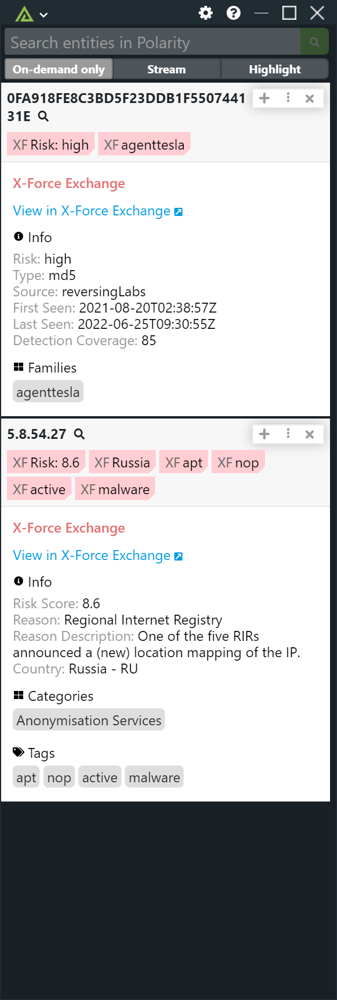

# Polarity X-Force Exchange Integration

|  |
|---|
|*X-Force Exchange Example*|

## X-Force Exchange Integration Options

### Host

The host to use for the X-Force Exchange API.

### API Key

API key to use for authentication with X-Force Exchange.

### Password

Password to use for authentication with X-Force Exchange.

### Minimum Score

Minimum risk score necessary to display a matching entry (does not apply to malware/hash entities). Valid values are 0 to 10.

### Minimum Risk

Minimum risk level necessary to display a matching entry (only applies to malware/hash entities). Valid values are "low", "medium", and "high"

### Blacklist Domains and IPs

Comma delimited List of domains and IPs that you never want to send to X-Force Exchange (private IP addresses are never sent)

### Domain Black List Regex

Domains that match the given regex will not be looked up (if blank, no domains will be black listed)

### IP Black List Regex

IPs that match the given regex will not be looked up (if blank, no IPs will be black listed)

## Installation Instructions

Installation instructions for integrations are provided on the [PolarityIO GitHub Page](https://polarityio.github.io/).

## Polarity

Polarity is a memory-augmentation platform that improves and accelerates analyst decision making.  For more information about the Polarity platform please see: 

https://polarity.io/
